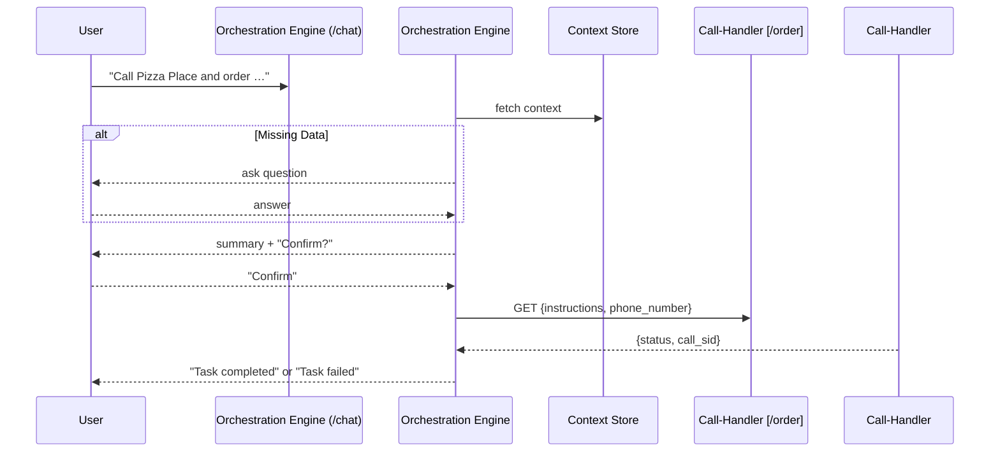

# AI Assistant Orchestration Engine – Product Requirements Document (updated)

## 1. Purpose
Deliver a conversational AI assistant that can execute real‑world tasks—beginning with placing phone calls via Twilio and OpenAI’s real‑time model—through a simple text interface. The assistant should minimise back‑and‑forth by recalling user context, confirming the task details, performing the action, and notifying the user when done.

## 2. Background & Existing Capabilities
### 2.1 Call‑Handler Service (`main.py`, **port 5002**)
* **Framework** FastAPI + asyncio.
* **`GET /order`** – initiates an **outbound phone call** using Twilio. Query params:
  * `instructions` – free‑text prompt that will be read/used by the AI.
  * `phone_number` – destination number (local or international; validated by regex).
  * Returns JSON `{ "status": "Call initiated", "call_sid": "…" }`.
* **`/media-stream` WebSocket** – Twilio streams μ‑law audio. Handler:
  * Opens a **WebSocket to OpenAI** (`gpt‑4o‑realtime-preview`) and forwards audio both ways.
  * Sends `session.update` with dynamic `instructions`, `turn_detection`, input/output formats, and selected voice (`alloy`).
  * Streams OpenAI audio deltas back to Twilio in real time.
* **Configuration** via `.env` (OPENAI_API_KEY, TWILIO_ACCOUNT_SID, TWILIO_AUTH_TOKEN, TWILIO_PHONE_NUMBER, etc.).
* **Robust logging & error‑handling** for OpenAI/Twilio disconnects, validation failures, and retries.

> **Summary** – The call‑handler already converts text instructions → two‑way phone conversation in Hebrew. The forthcoming **Orchestration Engine** will sit in front of it, generate the instructions, and call `/order`.

## 3. Goals & Objectives
1. **MVP** – Replace the placeholder chat endpoint with an engine that:
   * Stores minimal user context (file/in‑memory initially).
   * Asks only clarifying questions, then summarises and confirms.
   * Invokes **`GET /order`** on the call‑handler.
   * Notifies the user once the task succeeds or fails.
2. **Iterative Foundation** – Easy upgrade path to DB persistence, real‑time progress, additional task types, and multiple channels (WhatsApp, voice, etc.).
3. **Privacy & Transparency** – All stored user data is visible and deletable by the user; deeper compliance (GDPR, auth) scheduled for later phases.

## 4. Functional Requirements
| ID | Requirement |
|----|-------------|
| **FR‑1** | **Chat API** – `/chat` accepts user text and returns structured JSON replies. |
| **FR‑2** | **Context Management** – Initial: in‑memory or local JSON file. Provide `GET /context`, `DELETE /context`. |
| **FR‑3** | **Task Confirmation** – Assistant echoes intent/parameters and requires explicit `confirm`. |
| **FR‑4** | **Task Execution** – On confirmation, send **HTTP `GET`** to `CALL_HANDLER_HOST:/order` with `instructions` & `phone_number`. Handle response `{call_sid}`. |
| **FR‑5** | **Completion Notice** – Single summary message when task finishes (success/fail). No streaming updates (yet). |
| **FR‑6** | **Error Handling** – User sees generic failure; full trace logged to file. |
| **FR‑7** | **Logging** – Timestamp, user ID, task ID, and external API status for every step. |
| **FR‑8** | **Extensibility Hooks** – Clear interface so new task types (e.g., bookings) plug in.

## 5. Non‑Functional Requirements
* **Performance** – ≤ 500 ms average chat response latency.
* **Reliability** – 99 % uptime target; graceful degradation if Twilio/OpenAI fail.
* **Scalability** – 100 concurrent active calls in MVP (vertical scaling acceptable).
* **Security** – No secrets in logs; user data confined to removable store; roadmap includes authentication & GDPR.
* **Maintainability** – Typed Python code, unit tests, CI.

## 6. User Flow (MVP)

## 7. API Design (planned)
| Service | Endpoint | Method | Purpose |
|---------|----------|--------|---------|
| **Orchestration** | `/chat` | POST | main conversational endpoint |
| | `/context` | GET/DELETE | inspect & erase stored context |
| **Call‑Handler** (existing) | `/order` | **GET** | start phone call |
| | `/media-stream` | WS | audio bridge (Twilio ↔ OpenAI) |

## 8. Error Handling & Logging
* UI shows concise failure text; log file `logs/YYYY‑MM‑DD.log` keeps stack traces.
* Automatic retry (≤ 3) for transient HTTP 5xx/connection failures.

## 9. Data Storage Strategy
| Phase | Storage | Notes |
|-------|---------|-------|
| P0 | in‑memory dict | resets on restart |
| P1 | JSON/YAML file | visible & deletable by user |
| P2 | SQLite/PostgreSQL | multi‑user, ACID |

## 10. Roadmap
1. **Phase 0** – Health check, logging scaffold.
2. **Phase 1** – Implement FR‑1 → FR‑5; integrate `/order`.
3. **Phase 2** – File‑based context + `/context` endpoints.
4. **Phase 3** – DB persistence, auth, WebSocket progress.
5. **Phase 4** – Multi‑channel (WhatsApp), GDPR, analytics.

## 11. Open Questions
* Preferred auth mechanism & timeline?
* UI modality (web vs. desktop CLI)?
* Target scale for simultaneous users?

## 12. Glossary
* **Orchestration Engine** – Front‑end FastAPI service under development.
* **Call‑Handler** – Existing service (`main.py`) that converts text instructions into a live phone conversation via Twilio/OpenAI.
* **Context Store** – Layer that remembers user preferences & data.

