# PRD: Alfred – Your Intelligent Communication Guardian

**Product Name:** Alfred
**Version: 2.0** (Supersedes PRD Draft 1.0, based on BRD v2.0)
**Date:** May 13, 2025
**Prepared For:** Alfred Development Team, Project Stakeholders
**Prepared By:** Gemini AI (Senior Product Manager), based on BRD by Brainstormer
## 1. Introduction & Purpose

This Product Requirements Document (PRD) defines the features, functionalities, and technical considerations for **Alfred version 2.0**, an advanced AI assistant envisioned as an "Intelligent Communication Guardian." This document builds upon the Business Requirements Document (BRD) v2.0 dated May 13, 2025, and provides the detailed specifications necessary for the design, development, and testing of Alfred.

Alfred aims to empower both **personal and business users** by managing their **inbound and outbound phone communications** with unprecedented control, efficiency, and intelligence. It will leverage **agentic capabilities** (performing actions) and **Retrieval Augmented Generation (RAG)** (accessing and using knowledge) to understand user needs, execute tasks, and provide contextually relevant interactions. A core tenet of Alfred's design is its **high configurability**, allowing users to tailor Alfred with custom instructions, specific knowledge bases, and defined integrations.

This PRD will guide the development team in building a product that meets strategic business goals and addresses key user needs, including the crucial capability of inbound call handling.

## 2. Goals & Objectives

- **Primary Goal:** To deliver an AI assistant (Alfred) that acts as an intelligent guardian for users' phone communications, filtering noise, prioritizing important calls, and automating routine tasks for both inbound and outbound scenarios.
- **Objectives for MVP:**
    - Enable users to configure Alfred to screen inbound calls based on custom rules and knowledge.
    - Allow Alfred to handle basic inbound inquiries autonomously using RAG or take messages.
    - Empower users to initiate simple outbound calls via Alfred.
    - Provide a user-friendly interface for basic configuration of Alfred's behavior and RAG sources.
    - Ensure a secure and reliable core platform for call handling and AI processing.
- **Long-Term Objectives:**
    - Establish Alfred as a market leader in intelligent communication management.
    - Continuously enhance Alfred's agentic capabilities, RAG sophistication, and integration options.
    - Provide significant time savings, productivity gains, and cost reductions for users.
    - Achieve high user satisfaction and adoption across target segments.

## 3. Target Users & Personas (Summary)

Alfred targets two main user segments: Personal Users and Business Users. Detailed personas are available in BRD v2.0, Section 1.b. A summary is provided below:

- **Persona 1: Sarah Chen (Overwhelmed Professional):** Seeks to reclaim focus time, avoid spam, ensure important calls are not missed, and delegate routine outbound calls. Values control and efficiency.
- **Persona 2: David Miller (Small Business Owner - Local Bakery):** Needs to handle basic customer inquiries via phone, filter sales calls, automate supplier confirmations, and capture leads without a dedicated receptionist. Values efficiency and cost-effectiveness.
- **Persona 3: Maria Rodriguez (Call Center Manager):** Aims to reduce agent workload, improve FCR, decrease wait times, provide 24/7 basic support, and increase operational efficiency using Alfred as a configurable "First Agent."

## 4. Feature Definition & Prioritization (Kano Model)

Features derived from the Business Requirements (BRD v2.0, Section 4.a) are categorized using the Kano model to guide prioritization, particularly for the MVP.

### 4.1. Feature List & Kano Classification

|   |   |   |   |   |
|---|---|---|---|---|
|**Feature ID**|**Feature Name**|**Derived from BR(s)**|**Kano (MVP Focus)**|**Notes**|
|**Core Platform & Configuration**|
|F-CP-01|Text-based Chat Interface|BR-Core-01|Basic|For commands, updates, basic config.|
|F-CP-02|Voice Input/Output in Chat|BR-Core-01|Performance|Future enhancement for chat interface.|
|F-CP-03|File Attachment Support in Chat|BR-Core-01|Excitement|Primarily for RAG source upload via chat.|
|F-CFG-01|Custom Instruction Management|BR-Core-02a|Basic (MVP simple)|Text-based rules, scripts, personality. Advanced logic post-MVP.|
|F-CFG-02|Custom RAG Knowledge Base Management|BR-Core-02b|Basic (MVP simple)|Upload (PDF, TXT for MVP), manage sources.|
|F-CFG-03|External System Integration Management|BR-Core-02c|Performance|MVP: Basic calendar/webhook. Advanced integrations post-MVP.|
|F-AI-01|Task Execution Engine (Agentic)|BR-Core-03|Basic (MVP call)|Perform call-related actions. Broader tasks post-MVP.|
|F-AI-02|RAG Pipeline for Client Knowledge|BR-Core-04|Basic|Core RAG functionality (processing, retrieval).|
|F-AI-03|RAG-Informed Responses|BR-Core-04|Basic (MVP simple)|Contextual answers in calls/chat. Sophistication post-MVP.|
|**Inbound Call Handling**|
|F-IN-01|Designated Alfred Phone Number|BR-Inbound-01|Basic|Provisioning of a number for Alfred.|
|F-IN-02|Inbound Call Answering|BR-Inbound-01|Basic|Alfred answers calls.|
|F-IN-03|Conversational AI for Intent Recognition (Inbound)|BR-Inbound-02|Basic (MVP simple)|NLU to understand caller intent. Accuracy is Performance.|
|F-IN-04|RAG-Assisted Intent Disambiguation|BR-Inbound-02|Performance|Using RAG to clarify ambiguous intents.|
|F-IN-05|Spam/Robocall Detection & Blocking|BR-Inbound-03|Basic (MVP simple)|Database lookup for MVP. Heuristics/AI post-MVP.|
|F-IN-06|Rule-Based Call Filtering (User Defined)|BR-Inbound-03|Performance|Based on custom instructions.|
|F-IN-07|Autonomous Call Handling (Alfred Resolves)|BR-Inbound-04|Basic (MVP RAG)|Alfred handles call end-to-end.|
|F-IN-08|Call Transfer to Human/Department|BR-Inbound-04|Basic (MVP single)|Transfer to one predefined number for MVP. Multi-number/dept post-MVP.|
|F-IN-09|Call Transfer to another AI Agent|BR-Inbound-04|Excitement|Future capability.|
|F-IN-10|Message Taking|BR-Inbound-04|Basic|Record audio, transcription (performance).|
|F-IN-11|Callback Scheduling|BR-Inbound-04|Performance|MVP: Capture details. Full scheduling post-MVP.|
|F-IN-12|RAG-Powered Information for Callers|BR-Inbound-05|Performance|Providing answers from RAG to callers.|
|F-IN-13|Call Summary & Context for Transfers|BR-Inbound-05|Performance|Providing info to human agent on transfer.|
|**Outbound Call Handling**|
|F-OUT-01|User-Triggered Outbound Calls|BR-Outbound-01|Basic|Initiate via chat/command.|
|F-OUT-02|Scheduled/Triggered Outbound Calls|BR-Outbound-01|Performance|Based on time or system events.|
|F-OUT-03|Scripted Outbound Calling|BR-Outbound-02|Basic (MVP simple)|Simple reminders, info dissemination.|
|F-OUT-04|Conversational AI for Outbound Interactions|BR-Outbound-02|Performance|Natural conversation for tasks like surveys, qualification.|
|F-OUT-05|RAG for Context in Outbound Calls|BR-Outbound-02|Performance|Using RAG to inform outbound conversations.|
|F-OUT-06|Agentic Actions Post-Outbound Call|BR-Outbound-02|Performance|E.g., update CRM via webhook.|
|**General Platform Features**|
|F-GEN-01|Multi-User Support (Business)|BR-General-01|Performance|MVP: Single admin. User accounts, RBAC post-MVP.|
|F-GEN-02|Task Confirmation & Verification|BR-General-02|Performance|For critical actions.|
|F-GEN-03|Outcome Communication (Updates & Summaries)|BR-General-03|Basic|Real-time status, call/task summaries.|
|F-GEN-04|Contextual Conversation Management|BR-General-04|Basic|History & session context.|
|F-GEN-05|User Control Over Data|BR-General-06|Basic|Manage RAG sources, view personal data.|
|F-GEN-06|Consent Management|BR-General-06|Performance|E.g., for call recording (if implemented).|
|F-GEN-07|System Operation Logging|BR-General-08|Basic|For debugging, support.|
|F-GEN-08|Audit Trails for Key Actions|BR-General-08|Performance|For security & compliance.|
|F-GEN-09|User-Facing Call Logs|BR-General-08|Basic|View history of calls handled by Alfred.|

_(Kano classification: Basic = Must-be, Performance = More is better, Excitement = Delighter. MVP focus is primarily on Basic, with some core Performance features.)_

## 5. Functional Requirements

Details for key features. This is not exhaustive for all sub-features but covers critical aspects.

### 5.1. Core Platform & Configuration

- **F-CFG-01: Custom Instruction Management**
    - FR-CFG-01.1: Users shall be able to create, read, update, and delete text-based custom instructions through the Configuration Portal.
    - FR-CFG-01.2: MVP instructions shall support simple "IF condition THEN action" logic (e.g., IF caller_id IN VIP_list THEN transfer_call_to_user).
    - FR-CFG-01.3: Post-MVP instructions shall support more complex conditional branching, variables, and references to RAG context.
    - FR-CFG-01.4: Users shall be able to define basic personality/tone guidelines for Alfred's responses (e.g., select from predefined tones, or provide short textual guidance).
    - FR-CFG-01.5: The system shall validate instruction syntax and provide user-friendly error messages.
- **F-CFG-02: Custom RAG Knowledge Base Management**
    - FR-CFG-02.1: Users shall be able to upload documents (MVP: .txt, .pdf) to their client-specific knowledge base via the Configuration Portal.
    - FR-CFG-02.2: The system shall process uploaded documents by chunking them into manageable segments and generating vector embeddings for retrieval.
    - FR-CFG-02.3: Users shall be able to view a list of their uploaded documents, their processing status (e.g., pending, active, error), and delete documents.
    - FR-CFG-02.4: Alfred shall use only the active knowledge base documents associated with that specific client for RAG-informed responses.
- **F-AI-01: Task Execution Engine (Agentic)**
    - FR-AI-01.1: Alfred shall be able to initiate outbound calls based on user commands from the chat interface or as defined in custom instructions.
    - FR-AI-01.2: Alfred shall be able to execute actions based on interpreted call content and custom instructions (e.g., transfer call, take message, end call).
    - FR-AI-01.3: Post-MVP: Alfred shall be able to interact with approved, integrated external systems (e.g., query a calendar, post data to a webhook).
- **F-AI-03: RAG-Informed Responses**
    - FR-AI-03.1: During calls or chat interactions, Alfred shall query the client-specific RAG service with the user's/caller's query or relevant context.
    - FR-AI-03.2: The RAG service shall retrieve relevant chunks of information from the client's knowledge base.
    - FR-AI-03.3: Alfred (via an LLM) shall synthesize the retrieved information into a coherent, natural language response.
    - FR-AI-03.4: If no relevant information is found, or confidence is low, Alfred shall indicate it cannot answer from the provided knowledge or follow a fallback instruction.

### 5.2. Inbound Call Handling

- **F-IN-02: Inbound Call Answering**
    - FR-IN-02.1: Alfred shall monitor the designated phone number for incoming calls.
    - FR-IN-02.2: Upon receiving a call, Alfred shall answer promptly (within NFR limits).
    - FR-IN-02.3: Users shall be able to configure a custom greeting message (text-to-speech) for Alfred to play at the start of an inbound call.
- **F-IN-03: Conversational AI for Intent Recognition (Inbound)**
    - FR-IN-03.1: Alfred shall convert the caller's speech to text in real-time.
    - FR-IN-03.2: Alfred shall use NLU models to identify the primary intent(s) and key entities (e.g., names, topics, urgency cues) from the transcribed caller speech.
    - FR-IN-03.3: Intent recognition shall drive subsequent actions as defined in custom instructions or default logic.
- **F-IN-05: Spam/Robocall Detection & Blocking**
    - FR-IN-05.1: The system shall maintain/integrate with a database of known spam phone numbers.
    - FR-IN-05.2: Alfred shall automatically terminate calls from numbers identified with high confidence as spam, as per user configuration.
    - FR-IN-05.3: Users shall be able to report numbers as spam to help improve filtering.
- **F-IN-07 to F-IN-11: Dynamic Call Routing & Escalation**
    - FR-IN-DR-01: Based on intent, RAG output, and custom instructions, Alfred shall autonomously handle the caller's query if possible.
    - FR-IN-DR-02: (MVP) Alfred shall transfer the call to a single, pre-configured phone number if an instruction dictates a transfer.
    - FR-IN-DR-03: (Post-MVP) Alfred shall support transfer to multiple numbers/departments based on rules.
    - FR-IN-DR-04: If configured or transfer fails, Alfred shall prompt the caller to leave a voice message.
    - FR-IN-DR-05: Voice messages shall be recorded, stored, and made accessible to the user (audio & transcription if feasible).
    - FR-IN-DR-06: (MVP) Alfred shall be able to capture details for a callback request (name, number, reason) and inform the user.

### 5.3. Outbound Call Handling

- **F-OUT-01: User-Triggered Outbound Calls**
    - FR-OUT-01.1: Users shall be able to instruct Alfred to initiate an outbound call via the chat interface (e.g., "Alfred, call [phone number] and ask about X").
    - FR-OUT-01.2: Alfred shall confirm the number and basic purpose before initiating the call (if ambiguous).
- **F-OUT-03: Scripted Outbound Calling**
    - FR-OUT-03.1: Users shall be able to define simple scripts or objectives for outbound calls (e.g., appointment reminder, simple information delivery).
    - FR-OUT-03.2: Alfred shall follow the script, utilizing TTS for its speech and STT/NLU to understand responses.
    - FR-OUT-03.3: Alfred shall log the outcome of the scripted interaction (e.g., confirmed, not answered, information provided).

### 5.4. General Platform Features

- **F-GEN-03: Outcome Communication**
    - FR-GEN-03.1: Alfred shall provide updates on ongoing tasks (e.g., "Calling John Doe...") in the chat interface.
    - FR-GEN-03.2: After a call or task, Alfred shall provide a summary of the outcome (e.g., "Call completed with John Doe, message taken," or "Appointment confirmed.").
- **F-GEN-09: User-Facing Call Logs**
    - FR-GEN-09.1: Users shall be able to view a chronological log of all inbound and outbound calls handled by Alfred.
    - FR-GEN-09.2: Call log entries shall include details such as date/time, caller/called number, call duration, and a brief disposition (e.g., message taken, transferred to user, spam blocked, task completed).
    - FR-GEN-09.3: Users shall be able to access recorded messages directly from the call log.

## 6. Non-Functional Requirements

### 6.1. Performance & Latency

- **NFR-P01:** Call connection time to Alfred: < 3 seconds from call initiation by an external party.
- **NFR-P02:** Alfred's voice response latency during a call (turn-taking): < 1 second after the caller finishes speaking for typical conversational turns. This includes STT, NLU, logic processing, RAG query (if any), and TTS initiation.
- **NFR-P03:** RAG retrieval and synthesis for a typical query within a call: < 2 seconds.
- **NFR-P04:** Chat interface response time for user actions (sending message, loading history): < 1 second.
- **NFR-P05:** Configuration Portal page load and data save operations: < 3 seconds.
- **NFR-P06 (MVP):** System must support at least 5 concurrent calls for a small business client and 1 concurrent call for a personal user without degradation. Targets to be scaled post-MVP.

### 6.2. Reliability & Availability

- **NFR-R01:** Core Alfred platform services (API, Orchestrator, Call Logic) uptime: >= 99.9% (excluding scheduled maintenance, max 45 mins/month downtime).
- **NFR-R02:** Graceful degradation: In case of partial LLM or RAG service outages, core call answering and basic rule-based routing (non-AI dependent) should remain functional if possible. Users should be informed of reduced functionality.
- **NFR-R03:** Data Backup: Automated daily backups of user configurations, RAG metadata, and call logs.
- **NFR-R04:** RPO (Recovery Point Objective): 1 hour. RTO (Recovery Time Objective): 4 hours for critical services.

### 6.3. Scalability

- **NFR-S01:** Architecture must support horizontal scaling of stateless services (e.g., API gateway, Orchestrator instances, Voice AI processing).
- **NFR-S02:** Database solutions chosen must support scaling for anticipated user growth and data volume.
- **NFR-S03 (Year 1 Target):** Support 10,000 active users and 500 concurrent calls across the platform.

### 6.4. Security

- **NFR-SEC01:** All Personally Identifiable Information (PII), call audio, call transcriptions, and uploaded RAG documents must be encrypted at rest (AES-256 or stronger) and in transit (TLS 1.3 or 1.2).
- **NFR-SEC02:** Secure authentication mechanisms (e.g., OAuth 2.0 with MFA option) for user access to the Chat Interface and Configuration Portal.
- **NFR-SEC03:** Protection against common web application vulnerabilities (OWASP Top 10). Code reviews and vulnerability scanning to be part of the development lifecycle.
- **NFR-SEC04:** Secure management of API keys and credentials for third-party services (LLMs, Telephony).
- **NFR-SEC05:** Access to backend systems and databases restricted to authorized personnel only.
- **NFR-SEC06:** Comprehensive audit logs for security-sensitive events (e.g., login attempts, configuration changes, data access).

### 6.5. Usability

- **NFR-U01:** New user onboarding for basic call screening setup (spam filter, one rule, one RAG doc upload) should take less than 20 minutes.
- **NFR-U02:** The Configuration Portal must be intuitive enough for non-technical users (e.g., Sarah, David) to define simple custom instructions and manage RAG documents without requiring extensive training.
- **NFR-U03:** Error messages throughout the system must be clear, concise, and guide the user towards a solution.
- **NFR-U04:** The Chat Interface should provide a natural and efficient way to interact with Alfred for commands and information retrieval.
- **NFR-U05:** WCAG 2.1 AA accessibility guidelines should be considered for user-facing interfaces (long-term goal).

### 6.6. Maintainability

- **NFR-M01:** The system shall be designed with a modular (e.g., microservices) architecture to allow for independent development, deployment, and scaling of components.
- **NFR-M02:** Comprehensive logging (application logs, request/response logs, error logs) for all services to facilitate debugging and monitoring.
- **NFR-M03:** Code shall be well-documented, adhering to defined coding standards.
- **NFR-M04:** Automated testing (unit, integration, E2E) coverage targets to be defined and met.

### 6.7. Compliance

- **NFR-C01:** The system shall be designed to enable compliance with relevant data privacy regulations (e.g., GDPR, CCPA), including mechanisms for data access, rectification, and deletion requests.
- **NFR-C02:** If call recording is implemented, explicit consent mechanisms must be included, and users must be able to configure recording behavior (e.g., always on with notification, on-demand, never). Default to no recording for MVP unless explicit user config.
- **NFR-C03:** Secure storage and access controls for any recorded call data.

### 6.8. Interoperability

- **NFR-I01 (Post-MVP):** APIs for key external integrations (e.g., calendar, webhooks) shall be well-defined, versioned, and documented.
- **NFR-I02:** The system must gracefully handle temporary unavailability or errors from third-party integrated services (LLMs, Telephony, external systems).

### 6.9. Data Integrity

- **NFR-DI01:** Mechanisms to prevent data corruption during storage and processing of user configurations and RAG knowledge bases.
- **NFR-DI02:** Input validation for all user-configurable data to maintain consistency.

## 7. User Workflows & Journeys (User Story Mapping Examples)

Detailed user journeys help illustrate how users will interact with Alfred to achieve their goals. These are derived from the personas and their needs.

### 7.1. Persona: Sarah Chen - Managing Inbound Calls for Focus Time

**Goal:** Reclaim focus time by eliminating spam and non-critical call interruptions.

|   |   |   |
|---|---|---|
|**Activity**|**Task**|**User Story (Feature Link)**|
|**Initial Setup**|1. Sign up & Get Alfred Number.|As Sarah, I want to easily sign up and get an Alfred phone number so I can start managing my calls. (F-IN-01)|
||2. Configure basic spam blocking.|As Sarah, I want Alfred to automatically block known spam callers so I'm not disturbed. (F-IN-05)|
||3. Define "VIP List" to always pass through.|As Sarah, I want to specify that calls from my manager and family (VIPs) always get transferred to me. (F-CFG-01, F-IN-08)|
||4. Define rule for unknown callers during work hours.|As Sarah, I want to set a rule that unknown callers during 9-5 Mon-Fri should be asked their purpose; if unclear, take a message. (F-CFG-01, F-IN-10)|
|**Activating "Busy Mode"**|1. Inform Alfred to enter "Busy Mode".|As Sarah, I want to tell Alfred via chat "I'm in a meeting, activate Busy Mode" so only VIP calls come through. (F-CP-01, F-CFG-01)|
||2. Alfred confirms mode change.|Alfred confirms "Busy Mode activated. Only VIP calls will be transferred. Others will go to voicemail." (F-GEN-03)|
|**During "Busy Mode"**|1. Non-VIP call arrives.|Alfred receives a call from a non-VIP number.|
||2. Alfred handles according to "Busy Mode" rule.|Alfred informs the caller Sarah is busy and takes a message. (F-IN-10)|
||3. VIP call arrives.|Alfred receives a call from Sarah's manager (VIP).|
||4. Alfred transfers VIP call to Sarah.|Alfred transfers the call to Sarah's personal number. (F-IN-08)|
|**Reviewing After Meeting**|1. Check Alfred for messages and missed call summaries.|As Sarah, I want to quickly see who called and get summaries of messages taken while I was busy. (F-CP-01, F-GEN-09, F-GEN-03)|
||2. Deactivate "Busy Mode".|As Sarah, I want to tell Alfred "I'm available now, deactivate Busy Mode". (F-CP-01)|

### 7.2. Persona: David Miller - Configuring RAG for Bakery FAQs

**Goal:** Handle basic customer inquiries (store hours, location) via inbound calls using Alfred and RAG.

|   |   |   |
|---|---|---|
|**Activity**|**Task**|**User Story (Feature Link)**|
|**RAG Setup**|1. Login to Alfred Configuration Portal.|As David, I want to log in to a simple portal to manage Alfred's settings. (UI_Config)|
||2. Navigate to "Knowledge Base" / "My RAG".|As David, I want to easily find where to upload my bakery's information.|
||3. Upload "bakery_info.txt" containing hours, address, specials.|As David, I want to upload a simple text file with my bakery's FAQs so Alfred can learn them. (F-CFG-02)|
||4. Alfred processes the document.|Alfred ingests and indexes the "bakery_info.txt" for retrieval. (F-AI-02)|
|**Configuring Call Handling**|1. Set a rule for general inquiries.|As David, I want Alfred to answer general questions using the uploaded information before trying to transfer to me. (F-CFG-01, F-AI-03, F-IN-07)|
|**Inbound Call Scenario**|1. Customer calls bakery.|A customer calls David's Alfred-managed business line.|
||2. Customer asks "What are your hours today?"|The customer inquires about opening hours.|
||3. Alfred uses RAG to answer.|Alfred accesses the "bakery_info.txt" via RAG, finds the hours, and responds "We are open from 7 AM to 6 PM today." (F-IN-03, F-AI-03, F-IN-12)|
||4. Customer asks "Where are you located?"|The customer asks for the location.|
||5. Alfred uses RAG to answer.|Alfred finds the address in "bakery_info.txt" and provides it. (F-IN-03, F-AI-03, F-IN-12)|
||6. Customer asks about a custom cake (not in RAG).|The customer asks a complex question not in the FAQ document.|
||7. Alfred attempts RAG, then follows fallback rule.|Alfred tries RAG, finds no specific answer, and per David's rule (e.g., "If RAG can't answer, take a message for custom orders"), takes a message. (F-IN-10)|

## 8. Technical Feasibility & Conceptual Architecture

### 8.1. Conceptual Architecture Diagram

Code snippet

```mermaid
graph TD

%% ─────────────────────────────

%% User Interfaces

%% ─────────────────────────────

subgraph "User Interfaces"

UI_Chat["Chat Interface (Web/Mobile App)"]

UI_Config["Configuration Portal (Web)"]

end

  

%% ─────────────────────────────

%% Alfred Core Platform

%% ─────────────────────────────

subgraph "Alfred Core Platform (Cloud-Hosted)"

LB["Load Balancer"]

  

%% API Gateway

subgraph "API Gateway"

APIG["API Gateway"]

end

  

%% Core Services

subgraph "Core Services"

Orchestrator["Alfred Orchestrator (Agentic Engine)"]

ConfigService["Configuration Service"]

UserAuthService["User & Auth Service"]

NotificationService["Notification Service"]

end

  

%% Communication Handling

subgraph "Communication Handling"

TelephonyGateway["Telephony Gateway Service"] -- "SIP/WebRTC" --> TP["Telephony Provider (e.g., Twilio)"]

CallLogicService["Call Logic & State Management"]

VoiceAIService["Voice AI Service (STT/TTS)"] -- "Integrates" --> LLM_STT_TTS["3rd-Party STT/TTS APIs"]

end

  

%% AI & RAG

subgraph "AI & RAG"

NLU_IntentService["NLU & Intent Service"] -- "Integrates" --> LLM_NLU["3rd-Party LLM for NLU"]

RAGService["RAG Service (Indexing, Retrieval, Synthesis)"] -- "Accesses" --> RAG_DB["RAG Knowledge Bases (Vector DB, Doc Store)"]

RAGService -- "Integrates" --> LLM_RAG["3rd-Party LLM for Synthesis"]

end

  

%% Data Stores

subgraph "Data Stores"

UserDB["User & Configuration DB (SQL/NoSQL)"]

CallLogDB["Call & Activity Log DB (NoSQL)"]

RAG_DB

end

  

%% Integrations

subgraph "Integrations"

IntegrationService["Integration Service"] -- "APIs" --> ExtSys["External Systems (CRM, Calendar) – Post-MVP"]

end

  

%% Monitoring & Logging

subgraph "Monitoring & Logging"

LoggingService["Logging & Monitoring Service"]

end

end

  

%% ────────────────

%% External links

%% ────────────────

Users["Personal & Business Users"] --> UI_Chat

Users --> UI_Config

UI_Chat --> APIG

UI_Config --> APIG

  

APIG --> Orchestrator

APIG --> ConfigService

APIG --> UserAuthService

APIG --> TelephonyGateway

APIG --> RAGService

APIG --> IntegrationService

  

Orchestrator --> CallLogicService

Orchestrator --> NLU_IntentService

Orchestrator --> RAGService

Orchestrator --> IntegrationService

Orchestrator --> NotificationService

Orchestrator --> ConfigService

  

CallLogicService --> TelephonyGateway

CallLogicService --> VoiceAIService

CallLogicService --> NLU_IntentService

CallLogicService --> RAGService

CallLogicService --> CallLogDB

  

ConfigService --> UserDB

UserAuthService --> UserDB

RAGService --> RAG_DB

IntegrationService --> ExtSys

  

TelephonyGateway <--> TP

VoiceAIService <--> LLM_STT_TTS

NLU_IntentService <--> LLM_NLU

RAGService <--> LLM_RAG

  

LB --> APIG

  

%% ────────────────

%% Log connections

%% ────────────────

Orchestrator --> LoggingService

ConfigService --> LoggingService

UserAuthService --> LoggingService

NotificationService --> LoggingService

TelephonyGateway --> LoggingService

CallLogicService --> LoggingService

VoiceAIService --> LoggingService

NLU_IntentService --> LoggingService

RAGService --> LoggingService

IntegrationService --> LoggingService
```



### 8.2. Key Technical Considerations & Dependencies

- **Architecture Style:** Microservices architecture is recommended for key components (Orchestrator, Telephony Gateway, RAG Service, Configuration Service) to ensure scalability, resilience, and independent deployability.
- **Cloud Hosting:** Leverage a major cloud provider (AWS, GCP, Azure) for IaaS/PaaS (compute, storage, databases, networking, AI/ML services).
- **Telephony Integration:** Critical dependency on a robust Telephony API Provider (e.g., Twilio, Vonage) for PSTN connectivity, phone number provisioning, call control (answer, transfer, record), and real-time voice stream access (for STT). An abstraction layer is advisable.
- **AI Model Integration (LLMs, STT/TTS):**
    - **LLMs:** Dependency on providers like OpenAI, Anthropic, Google for NLU, RAG-based answer synthesis, and potentially conversational logic. Prompt engineering, context management, and cost optimization are key. An abstraction layer for LLMs is highly recommended to mitigate vendor lock-in.
    - **STT/TTS:** High accuracy STT (especially for diverse accents and noisy environments) and natural-sounding TTS are crucial for user experience. Can be sourced from LLM providers or specialized services.
- **RAG Implementation:**
    - **Document Processing:** Robust pipeline for ingesting various document types (text, PDF initially), chunking, generating embeddings, and storing them.
    - **Vector Database:** Selection of a scalable vector database (e.g., Pinecone, Weaviate, Milvus, or cloud-native options) for efficient similarity search.
    - **Retrieval & Synthesis Logic:** Fine-tuning retrieval strategies (e.g., hybrid search) and ensuring relevant, concise synthesis of information by the LLM.
- **Real-time Processing:** Low latency is paramount for call handling. Components involved in the live call path (Telephony Gateway, STT, NLU, Call Logic, RAG, TTS) must be highly performant.
- **Configuration Engine:** For custom instructions, a flexible rules engine or a DSL (Domain Specific Language) might be necessary for advanced logic, beyond simple key-value or text-based rules for MVP.
- **Security & Compliance:** Design for security from the ground up, including encryption, access controls, and considerations for data privacy regulations.

## 9. Acceptance Criteria (Gherkin Syntax Examples)

Acceptance Criteria define the testable conditions for a feature to be considered complete.

### 9.1. Feature: F-IN-10 Message Taking (MVP)

Gherkin

```
Feature: Alfred takes a voice message for the user

  Scenario: Alfred takes a message when a rule dictates and transfer is not applicable
    Given Sarah has a custom instruction: "If an unknown caller calls outside business hours (9 AM - 5 PM), take a message."
    And it is currently 7 PM
    And an unknown caller "Jane Smith" calls Sarah's Alfred number
    When Alfred answers the call
    And Alfred identifies the caller as unknown and the time as outside business hours
    And Alfred's instruction leads to "take a message"
    Then Alfred should inform Jane Smith that Sarah is unavailable and offer to take a message
    And Alfred should say "Please leave your name, number, and a short message after the tone."
    And Alfred should play a tone to indicate the start of recording
    And Alfred should record Jane Smith's voice message
    And the recording should stop after a reasonable period of silence or if Jane hangs up
    And Alfred should store the audio recording linked to the call log entry for this call
    And Alfred should send a notification to Sarah's chat interface: "New message from Jane Smith (Caller ID: [Jane's Number if available])."

  Scenario: Alfred attempts transcription of a taken message (Performance Goal for MVP, Core for Post-MVP)
    Given Alfred has successfully taken a voice message from "John Doe"
    When the call ends and the recording is saved
    Then the system should attempt to transcribe the voice message into text
    And the transcription should be stored alongside the audio recording in the call log
    And if transcription is successful, the notification to the user should include the transcribed text (or a snippet).
    And if transcription fails or has low confidence, the notification should indicate this, and the user can still access the audio.
```

### 9.2. Feature: F-CFG-02 Custom RAG Knowledge Base Management (MVP - PDF Upload)

Gherkin

```
Feature: User uploads and manages PDF documents for Alfred's RAG knowledge base

  Scenario: David uploads a PDF document to his bakery's RAG knowledge base
    Given David is logged into the Alfred Configuration Portal
    And David navigates to the "My Knowledge" or "RAG Documents" section
    When David clicks the "Upload Document" button
    And David selects a single PDF file named "Bakery_Specials_and_Hours.pdf" from his local system
    And David confirms the upload
    Then the system should start processing "Bakery_Specials_and_Hours.pdf" for RAG
    And the document should appear in David's list of RAG sources with a status like "Processing" or "Indexing"
    And David should receive an in-app notification or see the status change to "Active" once processing is complete and successful.

  Scenario: Alfred uses information from an uploaded PDF in an inbound call
    Given David has successfully uploaded "Bakery_Specials_and_Hours.pdf"
    And the PDF contains the sentence: "This week's special is the Strawberry Bliss Cake for $25."
    And a customer calls David's Alfred-managed business line
    When the customer asks Alfred, "What is your special this week?"
    And Alfred's NLU identifies the intent as "query weekly special"
    Then Alfred should query David's RAG knowledge base, including "Bakery_Specials_and_Hours.pdf"
    And Alfred should retrieve the information about the Strawberry Bliss Cake
    And Alfred should respond to the customer in natural language, e.g., "This week's special is our Strawberry Bliss Cake, available for $25."
```

## 10. Release Strategy & Incremental Roadmap

This roadmap prioritizes features for an iterative rollout, focusing on delivering core value early and building complexity incrementally. It aligns with the MoSCoW prioritization from BRD v2.0.

### 10.1. Minimum Viable Product (MVP) - Target Q4 2025: "Intelligent Guardian Basics"

- **Goal:** Validate core "Communication Guardian" concept for personal and simple SBO use cases. Focus on inbound screening, basic RAG, and user-triggered outbound.
- **Key Features:**
    - Core User Onboarding & Alfred Number Provisioning (F-IN-01)
    - Text-based Chat Interface (F-CP-01)
    - Basic Custom Instruction Management (text rules, IF-THEN for call routing) (F-CFG-01)
    - Basic RAG: Single TXT/PDF upload, management, and use in calls/chat (F-CFG-02, F-AI-02, F-AI-03)
    - Inbound Call Answering (F-IN-02)
    - Basic Caller Intent Understanding (F-IN-03)
    - Basic Spam Filtering (database lookup) (F-IN-05)
    - Autonomous Call Handling with RAG (FAQs) (F-IN-07)
    - Message Taking (audio, basic transcription if feasible) (F-IN-10)
    - Call Transfer (to one predefined number) (F-IN-08)
    - User-Triggered Outbound Calls (simple command, no complex conversation) (F-OUT-01, F-OUT-03)
    - Basic Outcome Communication & Call Logs (F-GEN-03, F-GEN-09)
    - Essential NFRs: Security, Reliability for MVP scale.

### 10.2. Release 1.1 (Post-MVP) - Q1 2026: "Enhanced Configuration & Business Foundation"

- **Goal:** Improve configurability, enhance RAG, basic integrations, strengthen SBO value.
- **Key Features:**
    - Advanced Custom Instructions (more complex logic, e.g., time-based rules, AND/OR conditions)
    - Enhanced RAG (multiple document uploads, improved management UI)
    - Basic Integrations (e.g., Google Calendar for personal, simple outbound webhook for business) (F-CFG-03)
    - Improved NLU for more accurate intent recognition
    - User-defined Call Filtering Rules (more granular than just spam) (F-IN-06)
    - Callback Scheduling (Alfred captures details for user action) (F-IN-11)
    - Contextual Information to Human Agent on Transfer (basic call summary) (F-IN-13)
    - User Dashboard for call analytics and RAG source overview.

### 10.3. Release 1.2 - Q2 2026: "Smarter Alfred & Deeper Business Value"

- **Goal:** More sophisticated AI, early multi-user capabilities for businesses, agentic tasks.
- **Key Features:**
    - Advanced RAG (smarter chunking/retrieval, confidence scoring, potential source linking)
    - Agentic Capabilities for Outbound Tasks (e.g., scripted surveys with dynamic responses, basic lead qualification) (F-OUT-04, F-OUT-06)
    - RAG for Context in Outbound Calls (F-OUT-05)
    - Basic Multi-User Support for Businesses (Admin can add team members, assign them as transfer targets) (F-GEN-01)
    - Task Confirmation for critical agentic actions (F-GEN-02)

### 10.4. Future Releases (Beyond R1.2 - Q3 2026 onwards)

- Full Multi-User Support (Roles, Permissions)
- Advanced Agentic Capabilities (Multi-step workflows, proactive suggestions)
- Visual Call Flow Builder for Custom Instructions
- Support for Additional Communication Channels (SMS, WhatsApp)
- Deep Enterprise Integrations (CRMs, Helpdesks)
- Advanced Analytics & Reporting
- Compliance Certifications (SOC2, HIPAA path if market demands)
- Multi-language Support

### 10.5. Key Dependencies & Parallel Workstreams

- **Critical Path Dependencies:**
    - Selection & integration of Telephony API Provider (for any call functionality).
    - Selection & integration of LLM & STT/TTS providers.
    - Development of Core Orchestrator and Call Logic Service.
    - Development of RAG pipeline (ingestion, indexing, retrieval).
- **Parallel Workstreams (Starting ASAP):**
    - UI/UX Design for Configuration Portal & Chat Interface.
    - Backend Infrastructure Setup (cloud environment, CI/CD).
    - Legal review for compliance aspects (data handling, call recording).
    - Ongoing R&D for AI model selection and optimization.

## 11. Risk Management & Assumptions (RAID Log)

This RAID log expands on the Risk Register from BRD v2.0.

| Category   | ID  | Description                                                                                                | Likelihood/Impact | Mitigation/Contingency                                                                                                | Owner              | Status |
| :--------- | :-- | :--------------------------------------------------------------------------------------------------------- | :---------------- | :-------------------------------------------------------------------------------------------------------------------- | :----------------- | :----- |
| Risk       | R01 | Key 3rd Party API (LLM/Telephony) outage, significant price increase, or adverse ToS change.               | M/H               | Design abstraction layers; Explore multi-provider strategy; Monitor usage & cost; Contractual terms if possible.      | Tech Lead/Product  | Open   |
| Risk       | R02 | RAG system provides inaccurate, irrelevant, or inappropriate information during live calls.                | M/H               | Rigorous testing of RAG pipeline; Document source validation; Confidence scoring for answers; User feedback loop.     | AI Team/Product    | Open   |
| Risk       | R03 | Alfred's agentic capabilities result in unintended negative consequences (e.g., wrong action taken).       | L/H               | Strict permissioning; Confirmation steps for critical tasks; "Dry run"/simulation mode; Detailed audit trails.        | AI Team/Product    | Open   |
| Risk       | R04 | Security breach leading to exposure of sensitive user data (call content, PII, RAG documents).             | L/H               | Security by design; Encryption (at rest & transit); Strong access controls; Regular security audits (post-MVP).       | Security/Tech Lead | Open   |
| Risk       | R05 | Users find Alfred too complex to configure (custom instructions, RAG), leading to low adoption/value.      | M/M               | Iterative UX design with user testing; Templates & examples; Clear documentation & tutorials; Phased feature rollout. | Product/UX/Support | Open   |
| Risk       | R06 | Ineffective spam/unwanted call filtering, leading to user frustration.                                     | M/M               | Multi-layered filtering (databases, heuristics, user feedback); Regular updates to filter lists & logic.              | AI Team/Product    | Open   |
| Risk       | R07 | System performance issues (high latency in calls, slow AI responses, call drops) under load.               | M/M               | Scalable architecture design; Continuous performance testing & monitoring; Optimize AI model usage.                   | Tech Lead          | Open   |
| Risk       | R08 | Misinterpretation of complex or conflicting user-defined custom instructions.                              | M/M               | Clear syntax definition; Server-side validation with conflict detection; UI aids for rule creation.                   | AI Team/Product    | Open   |
| Risk       | R09 | Legal/compliance issues related to call recording, data privacy (e.g., GDPR consent for inbound EU calls). | M/H               | Early legal consultation; Implement robust consent management features; Configurable data retention policies.         | Legal/Product      | Open   |
| Assumption | A01 | Core team has or can quickly acquire deep expertise in telephony, RAG, and agentic AI development.         | High if false     | Strategic hiring, specialized training, consultancy if needed. POCs for high-risk tech areas.                         | Management/Leads   | Open   |
| Assumption | A02 | Sufficient funding and resources will be consistently available throughout the defined roadmap phases.     | High if false     | Clear communication of resource needs; Phased delivery aligned with value demonstration for continued investment.     | Project Sponsor    | Open   |
| Assumption | A03 | Chosen 3rd party APIs (LLM, Telephony) will remain stable, performant, and economically viable.            | High if false     | Ongoing monitoring of API landscape; Proactive evaluation of alternatives. (Mitigation for R01 applies).              | Tech Lead/Product  | Open   |
| Assumption | A04 | Users are willing to invest a reasonable amount of time to configure Alfred for personalization benefits.  | Medium if false   | Focus on intuitive UX, clear value demonstration, good defaults, and pre-built templates. (Mitigation for R05).       | Product/UX         | Open   |
| Issue      | I01 | Detailed UX flows and UI designs for the Configuration Portal are pending.                                 | N/A               | Prioritize UX/UI design sprints for core configuration features.                                                      | UX Team/Product    | Open   |
| Dependency | D01 | Successful selection and integration of a primary Telephony API provider.                                  | Critical          | Technical evaluation and PoC completed by [Target Date].                                                              | Tech Lead          | Open   |
| Dependency | D02 | Stable and performant API access to selected LLM(s) for NLU, RAG synthesis, and conversational AI.         | Critical          | PoC and integration for chosen LLM(s) completed by [Target Date].                                                     | AI Team/Tech Lead  | Open   |

## 12. Success Metrics & KPIs (Reference BRD Section 6)

The success of Alfred will be measured against the KPIs defined in the Business Requirements Document v2.0, Section 6. Key categories include:

- Overall Alfred Adoption & Engagement (Active Users, Configured Instances, Churn Rate)
- "Intelligent Communication Guardian" - Core USP Metrics (Reduction in unwanted calls, Increase in focus time)
- Call Handling Performance (Total calls processed, FCR by Alfred, Message taking success)
- Efficiency & Cost Reduction (for Business Users)
- Customer Experience (CX) & User Satisfaction (NPS, CSAT)
- Revenue Generation (for Business Users - Leads qualified, etc.)
- System Performance & Reliability (Uptime, API response times, Error rates)

Specific targets for these KPIs will be set for each release.

## 13. Open Questions

- **Initial Telephony Provider Selection:** Which provider best meets our MVP needs for reliability, features, scalability, and cost? (Action: Tech Lead to finalize evaluation by [Date])
- **LLM Selection for Core Tasks:** Which LLM(s) offer the best balance of performance, cost, and fine-tuning capabilities for NLU, RAG, and conversational flow for MVP? (Action: AI Team to finalize evaluation by [Date])
- **Call Recording for MVP:** Is call recording a "Must Have" for any MVP persona? Current assumption is NOT for MVP unless user explicitly enables with full awareness of implications. Requires legal clarification for default behavior and consent mechanisms. (Action: Product/Legal to clarify by [Date])
- **Porting Existing Numbers:** What is the feasibility and timeline for allowing users to port their existing phone numbers to Alfred? (Assumption: Not for MVP, but a high-demand future feature).
- **Specific RAG Document Types for MVP:** Beyond TXT and PDF, are other formats critical for early adopters? (Current scope: TXT, PDF for MVP).
- **Detail level for Custom Instruction "Personality":** How deep should this go for MVP? Pre-defined list or simple free-text guidance? (Current scope: Simple selection/guidance).
